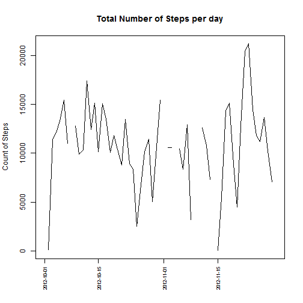
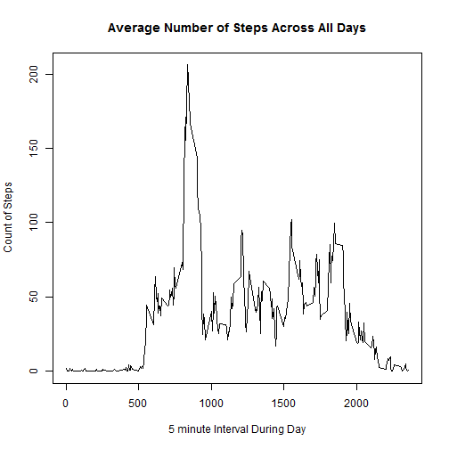
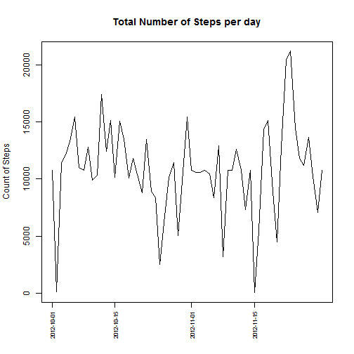
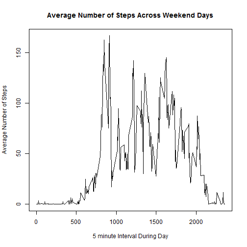
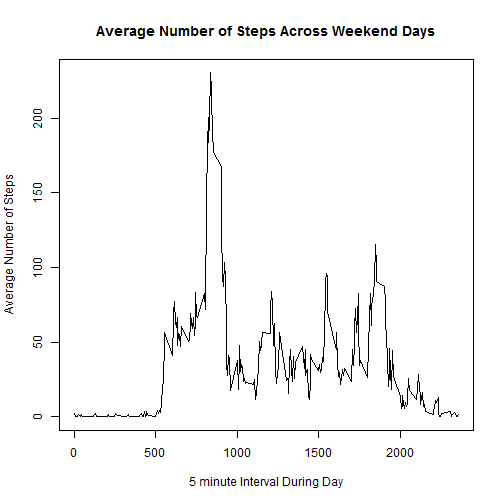

# Reproducible Research: Peer Assessment 1

This is the report based on personal movement data for the Reproducible Research Assignment 1. This report is designed to give a simple overview of the data that can be reproduced from the code in this github repository. 

## Loading and preprocessing the data

It is based on a small data set located [here](https://d396qusza40orc.cloudfront.net/repdata%2Fdata%2Factivity.zip). 

Data Format Instructions from the assignment:
        "The variables included in this dataset are:
        
        steps: Number of steps taking in a 5-minute interval (missing values are coded as NA)
        
        date: The date on which the measurement was taken in YYYY-MM-DD format
        
        interval: Identifier for the 5-minute interval in which measurement was taken
        
        The dataset is stored in a comma-separated-value (CSV) file and there are a total of 17,568 
        observations in this dataset."
        
To load the data we used the following code to download, unzip, and load the data into memory. Additionally we take the step of converting the date column to the correct datatype just after initial load:

```r
#download the zip file from the url provided in the assignment
sourceurl <- "http://d396qusza40orc.cloudfront.net/repdata%2Fdata%2Factivity.zip"
zipDestFile <- "./repdata-data-activity.zip"
#download the file to our current working directory
download.file(sourceurl, zipDestFile, mode="wb")
dateDownloaded <- date()

#unzip file
unzip(zipDestFile, overwrite = TRUE)

#read the data
#load the data.table package so that we can use the data.table functions for object comparison
if(!"package:data.table" %in% search()) {
        library(data.table)
}
personaldata <- data.table(read.csv("./activity.csv", header = TRUE))

#convert the date column to date format
personaldata$date <- as.POSIXct(personaldata$date)
```

## What is mean total number of steps taken per day?

The following plot and mean/median information shows the total number of steps taken per day over the two month period.


```r
#total number of steps taken per day
stepsperday <- personaldata[, sum(steps), by=date]
setnames(stepsperday, c("date", "V1"), c("date", "steps"))
with(stepsperday, plot(date, steps, type="l", xaxt="n", ylab = "Count of Steps", xlab="",
                       main = "Total Number of Steps per day"))
#x axis
datelabels = strftime(unique(personaldata$date), format="%d") %in% c('01', '15')
axis(side=1, at = stepsperday$date[datelabels], labels=stepsperday$date[datelabels], cex.axis = 0.7, las=3)
```

 

Here are the mean/median values for all the days in the two month period with the missing values removed to aid in computation:


```r
#mean and median per day
mean(stepsperday$steps, na.rm=TRUE)
```

```
## [1] 10766
```

```r
median(stepsperday$steps, na.rm=TRUE)
```

```
## [1] 10765
```

## What is the average daily activity pattern?

The following plot the average daily activity pattern for the two months:

```r
#average daily activity pattern
dailypattern <- personaldata[, mean(na.omit(steps)), by=interval]
setnames(dailypattern, c("interval", "V1"), c("interval", "steps"))
with(dailypattern, plot(interval, steps, type="l", ylab = "Count of Steps", xlab="5 minute Interval During Day",
                       main = "Average Number of Steps Across All Days"))
```

 

```r
#maximum 5 minute interval average across all days
dailypattern[dailypattern$steps == max(dailypattern$steps),]
```

```
##    interval steps
## 1:      835 206.2
```
## Imputing missing values

We discovered a number of missing values in the dataset, here is the number of missing values:

```r
#missing values in dataset
sum(is.na(personaldata$steps))
```

```
## [1] 2304
```

To correct for the missing step values, we used the average for the interval across all the days in the two month period. This would eliminate any bias from the missing values and use a approximate value to estimate the number of steps. 


```r
#use the average for that 5 minute interval across all the days to fill in the missing values
#create a new dataset for the removal of the NA data
personaldatasmooth <- personaldata
#find the indexes of the NA data
missingstepsindices <- which(is.na(personaldatasmooth$steps))
#find the intervals for the NA values
missingstepsdailyintervals <- personaldatasmooth$interval[missingstepsindices]
#assign the interval average for the missing data from the average interval dataset
personaldatasmooth$steps[missingstepsindices] <- dailypattern$steps[match(missingstepsdailyintervals, dailypattern$interval)]
```
Rerunning our original plot for the total number of steps per day we see that there is a small differene after we add the missing data into the dataset:

```r
#redo plot/mean/median
#mean total number of steps taken per day
stepsperdaysmooth <- personaldatasmooth[, sum(steps), by=date]
setnames(stepsperdaysmooth, c("date", "V1"), c("date", "steps"))
with(stepsperdaysmooth, plot(date, steps, type="l", xaxt="n", ylab = "Count of Steps", xlab="",
                       main = "Total Number of Steps per day"))
#x axis
datelabelssmooth = strftime(unique(personaldatasmooth$date), format="%d") %in% c('01', '15')
axis(side=1, at = stepsperdaysmooth$date[datelabelssmooth], labels=stepsperdaysmooth$date[datelabelssmooth], cex.axis = 0.7, las=3)
```

 

And we notice that the median changes slightly.

```r
#mean and median per day
mean(stepsperdaysmooth$steps)
```

```
## [1] 10766
```

```r
median(stepsperdaysmooth$steps)
```

```
## [1] 10766
```
## Are there differences in activity patterns between weekdays and weekends?
To look at the differences between weekdays and weekends we have to add a new categorical value to our dataset:

```r
#set the weekend category
personaldatasmooth$weekdaycategory[weekdays(personaldatasmooth$date) %in% c('Saturday', 'Sunday')] <- "weekend"
personaldatasmooth$weekdaycategory[weekdays(personaldatasmooth$date) %in% c('Monday', 'Tuesday', 'Wednesday', 'Thursday', 'Friday')] <- "weekday"

#create the smooth interval dataset
dailypatternsmooth <- personaldatasmooth[personaldatasmooth$weekdaycategory == "weekend", mean(steps), by=interval]
setnames(dailypatternsmooth, c("interval", "V1"), c("interval", "steps"))
```
Then when we look at the data we see tiny differences between the weekday and weekend numbers during the two months.

```r
with(personaldatasmooth[personaldatasmooth$weekdaycategory == "weekend", mean(steps), by=interval], 
     plot(interval, V1, type="l", ylab = "Average Number of Steps", xlab="5 minute Interval During Day",
          main = "Average Number of Steps Across Weekend Days"))
```

 

```r
with(personaldatasmooth[personaldatasmooth$weekdaycategory == "weekday", mean(steps), by=interval], 
     plot(interval, V1, type="l", ylab = "Average Number of Steps", xlab="5 minute Interval During Day",
          main = "Average Number of Steps Across Weekend Days"))
```

 
